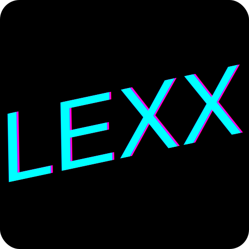

> This has nothing to do with IBM LEXX but is named after it.
> The IBM LEXX editor was the first editor to use live syntax highlighting
> (via REXX, therefore the XX)

Minimal as hell text editor for the browser. I find need to be
able to rapidly prototype quite a lot

## License
This project is covered under GPL v3.0 copy left license.
See [GPL v3](./LICENSE)

[Icon Inspiration](https://iamamainframer.blogspot.com/2021/01/writing-rexx-exec-to-create-valid-luhn.html). Based on REXX

